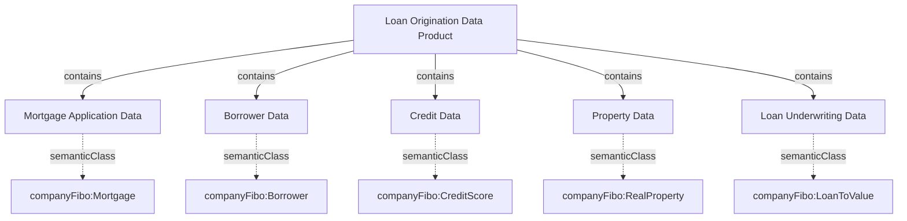
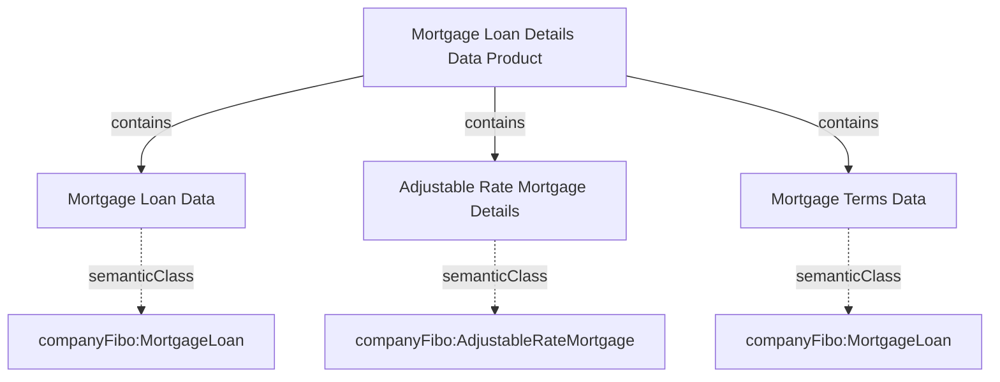
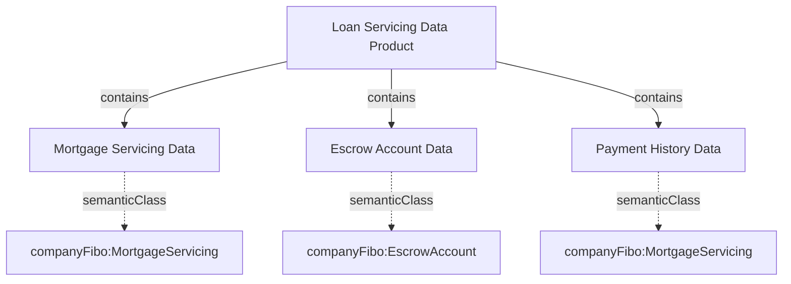
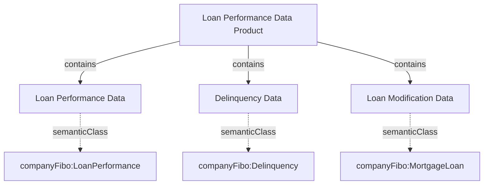
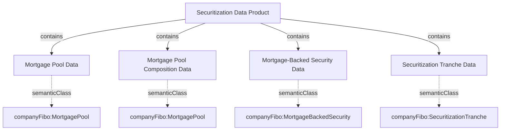
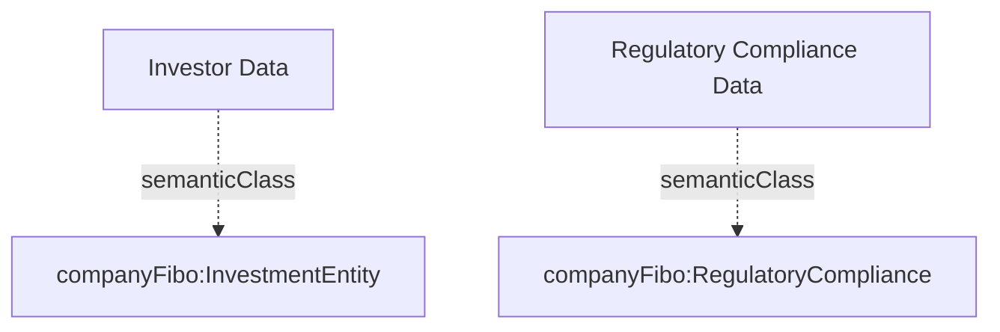

# Secondary Mortgage Market Datasets and Data Products

This document provides an overview of 20 datasets from the secondary mortgage domain, organized into 5 data products, with 2 datasets remaining standalone. These datasets reference FIBO (Financial Industry Business Ontology) loan real estate and mortgage-backed securities concepts.

## Data Products Overview

The datasets are organized into the following data products:

1. **Loan Origination Data Product**
2. **Mortgage Loan Details Data Product**
3. **Loan Servicing Data Product**
4. **Loan Performance Data Product**
5. **Securitization Data Product**

Plus two standalone datasets:
- Investor Data
- Regulatory Compliance Data

## Diagrams

### Overall Data Products and Datasets

```mermaid
graph TD
    %% Data Products
    DP1[Loan Origination Data Product]
    DP2[Mortgage Loan Details Data Product]
    DP3[Loan Servicing Data Product]
    DP4[Loan Performance Data Product]
    DP5[Securitization Data Product]
    
    %% Datasets for DP1
    DS1[Mortgage Application Data]
    DS2[Borrower Data]
    DS3[Credit Data]
    DS4[Property Data]
    DS5[Loan Underwriting Data]
    
    %% Datasets for DP2
    DS6[Mortgage Loan Data]
    DS7[Adjustable Rate Mortgage Details]
    DS8[Mortgage Terms Data]
    
    %% Datasets for DP3
    DS9[Mortgage Servicing Data]
    DS10[Escrow Account Data]
    DS11[Payment History Data]
    
    %% Datasets for DP4
    DS12[Loan Performance Data]
    DS13[Delinquency Data]
    DS14[Loan Modification Data]
    
    %% Datasets for DP5
    DS15[Mortgage Pool Data]
    DS16[Mortgage Pool Composition Data]
    DS17[Mortgage-Backed Security Data]
    DS18[Securitization Tranche Data]
    
    %% Standalone Datasets
    DS19[Investor Data]
    DS20[Regulatory Compliance Data]
    
    %% Relationships
    DP1 -->|contains| DS1
    DP1 -->|contains| DS2
    DP1 -->|contains| DS3
    DP1 -->|contains| DS4
    DP1 -->|contains| DS5
    
    DP2 -->|contains| DS6
    DP2 -->|contains| DS7
    DP2 -->|contains| DS8
    
    DP3 -->|contains| DS9
    DP3 -->|contains| DS10
    DP3 -->|contains| DS11
    
    DP4 -->|contains| DS12
    DP4 -->|contains| DS13
    DP4 -->|contains| DS14
    
    DP5 -->|contains| DS15
    DP5 -->|contains| DS16
    DP5 -->|contains| DS17
    DP5 -->|contains| DS18
```

### Individual Data Products

#### 1. Loan Origination Data Product

#### 2. Mortgage Loan Details Data Product

#### 3. Loan Servicing Data Product

#### 4. Loan Performance Data Product

#### 5. Securitization Data Product

#### Standalone Datasets

## Detailed Dataset Descriptions

### Data Product 1: Loan Origination Data Product

#### Dataset 1: Mortgage Application Data
- **Description**: Contains information about mortgage applications, including borrower details, property information, and loan terms requested
- **Domain Concept**: companyFibo:Mortgage
- **Key Attributes**:
  - application_id (string) → companyFibo:Mortgage.identifier
  - application_date (date) → companyFibo:Mortgage.originationDate
  - borrower_id (string) → companyFibo:Borrower.identifier
  - property_address (string) → companyFibo:RealProperty.address
  - loan_amount (decimal) → companyFibo:Mortgage.loanAmount
  - loan_purpose (string) → companyFibo:Mortgage.purpose
  - loan_type (string) → companyFibo:Mortgage.loanType

#### Dataset 2: Borrower Data
- **Description**: Contains detailed information about mortgage borrowers, including personal details, employment, and income information
- **Domain Concept**: companyFibo:Borrower
- **Key Attributes**:
  - borrower_id (string) → companyFibo:Borrower.identifier
  - first_name (string) → companyFibo:Borrower.givenName
  - last_name (string) → companyFibo:Borrower.familyName
  - dob (date) → companyFibo:Borrower.birthDate
  - ssn (string) → companyFibo:Borrower.nationalIdentifier
  - annual_income (decimal) → companyFibo:IncomeVerification.incomeAmount
  - employment_status (string) → companyFibo:Borrower.employmentStatus
  - employer_name (string) → companyFibo:Borrower.employer

#### Dataset 3: Credit Data
- **Description**: Contains credit information about mortgage applicants, including credit scores and history
- **Domain Concept**: companyFibo:CreditScore
- **Key Attributes**:
  - borrower_id (string) → companyFibo:Borrower.identifier
  - credit_score (integer) → companyFibo:CreditScore.scoreValue
  - credit_score_type (string) → companyFibo:CreditScore.scoreType
  - report_date (date) → companyFibo:CreditScore.reportDate
  - delinquencies_24m (integer) → companyFibo:CreditScore.delinquencyCount
  - bankruptcies (string) → companyFibo:CreditScore.bankruptcyInformation
  - total_debt (decimal) → companyFibo:Borrower.totalDebtAmount

#### Dataset 4: Property Data
- **Description**: Contains information about properties associated with mortgage applications
- **Domain Concept**: companyFibo:RealProperty
- **Key Attributes**:
  - property_id (string) → companyFibo:RealProperty.identifier
  - address (string) → companyFibo:RealProperty.address
  - property_type (string) → companyFibo:RealProperty.propertyType
  - year_built (integer) → companyFibo:RealProperty.constructionDate
  - square_footage (integer) → companyFibo:RealProperty.squareFootage
  - num_bedrooms (integer) → companyFibo:ResidentialProperty.bedroomCount
  - num_bathrooms (decimal) → companyFibo:ResidentialProperty.bathroomCount
  - appraisal_value (decimal) → companyFibo:PropertyValuation.appraisedValue
  - appraisal_date (date) → companyFibo:PropertyValuation.valuationDate
  - property_tax_annual (decimal) → companyFibo:PropertyTax.taxAmount

#### Dataset 5: Loan Underwriting Data
- **Description**: Contains data related to the underwriting process for mortgage loans
- **Domain Concept**: companyFibo:LoanToValue
- **Key Attributes**:
  - application_id (string) → companyFibo:Mortgage.identifier
  - underwriting_date (date) → companyFibo:Mortgage.underwritingDate
  - ltv_ratio (decimal) → companyFibo:LoanToValue.ratio
  - dti_ratio (decimal) → companyFibo:DebtToIncome.ratio
  - underwriting_decision (string) → companyFibo:Mortgage.approvalStatus
  - conditions (string) → companyFibo:Mortgage.approvalConditions
  - underwriter_id (string) → companyFibo:Mortgage.underwriterId
 
  ### Data Product 2: Mortgage Loan Details Data Product

#### Dataset 6: Mortgage Loan Data
- **Description**: Contains details about originated mortgage loans
- **Domain Concept**: companyFibo:MortgageLoan
- **Key Attributes**:
  - loan_id (string) → companyFibo:MortgageLoan.identifier
  - origination_date (date) → companyFibo:MortgageLoan.originationDate
  - maturity_date (date) → companyFibo:MortgageLoan.maturityDate
  - original_balance (decimal) → companyFibo:MortgageLoan.principalAmount
  - current_balance (decimal) → companyFibo:MortgageLoan.currentBalance
  - interest_rate (decimal) → companyFibo:MortgageLoan.interestRate
  - rate_type (string) → companyFibo:MortgageLoan.rateType
  - loan_term (integer) → companyFibo:MortgageLoan.loanTerm
  - is_conforming (boolean) → companyFibo:MortgageLoan.isConforming

#### Dataset 7: Adjustable Rate Mortgage Details
- **Description**: Contains specific details about adjustable rate mortgages
- **Domain Concept**: companyFibo:AdjustableRateMortgage
- **Key Attributes**:
  - loan_id (string) → companyFibo:AdjustableRateMortgage.identifier
  - index_type (string) → companyFibo:AdjustableRateMortgage.indexType
  - margin (decimal) → companyFibo:AdjustableRateMortgage.margin
  - initial_rate_period (integer) → companyFibo:AdjustableRateMortgage.initialPeriod
  - rate_adjustment_frequency (integer) → companyFibo:AdjustableRateMortgage.adjustmentFrequency
  - rate_cap_per_adjustment (decimal) → companyFibo:AdjustableRateMortgage.periodCap
  - lifetime_rate_cap (decimal) → companyFibo:AdjustableRateMortgage.lifetimeCap
  - next_adjustment_date (date) → companyFibo:AdjustableRateMortgage.nextAdjustmentDate

#### Dataset 8: Mortgage Terms Data
- **Description**: Contains details about mortgage terms and conditions
- **Domain Concept**: companyFibo:MortgageLoan
- **Key Attributes**:
  - loan_id (string) → companyFibo:MortgageLoan.identifier
  - monthly_payment (decimal) → companyFibo:MortgageLoan.paymentAmount
  - escrow_included (boolean) → companyFibo:MortgageLoan.hasEscrow
  - prepayment_penalty (string) → companyFibo:MortgageLoan.prepaymentPenalty
  - has_balloon_payment (boolean) → companyFibo:MortgageLoan.hasBalloonPayment
  - first_payment_date (date) → companyFibo:MortgageLoan.firstPaymentDate
  - points_paid (decimal) → companyFibo:MortgageLoan.pointsPaid

### Data Product 3: Loan Servicing Data Product

#### Dataset 9: Mortgage Servicing Data
- **Description**: Contains information about mortgage servicing activities
- **Domain Concept**: companyFibo:MortgageServicing
- **Key Attributes**:
  - loan_id (string) → companyFibo:MortgageLoan.identifier
  - servicer_id (string) → companyFibo:MortgageServicer.identifier
  - servicer_name (string) → companyFibo:MortgageServicer.name
  - servicing_start_date (date) → companyFibo:MortgageServicing.startDate
  - servicing_fee (decimal) → companyFibo:MortgageServicing.servicingFee
  - servicing_advances (decimal) → companyFibo:MortgageServicing.advancesAmount
  - payment_due_day (integer) → companyFibo:MortgageServicing.paymentDueDay

#### Dataset 10: Escrow Account Data
- **Description**: Contains information about mortgage escrow accounts
- **Domain Concept**: companyFibo:EscrowAccount
- **Key Attributes**:
  - loan_id (string) → companyFibo:MortgageLoan.identifier
  - escrow_balance (decimal) → companyFibo:EscrowAccount.accountBalance
  - monthly_escrow_payment (decimal) → companyFibo:EscrowAccount.paymentAmount
  - property_tax_annual (decimal) → companyFibo:PropertyTax.taxAmount
  - property_tax_payment_date (date) → companyFibo:PropertyTax.paymentDate
  - insurance_annual (decimal) → companyFibo:EscrowAccount.insuranceAmount
  - insurance_payment_date (date) → companyFibo:EscrowAccount.insurancePaymentDate
  - last_escrow_analysis (date) → companyFibo:EscrowAccount.analysisDate

#### Dataset 11: Payment History Data
- **Description**: Contains historical payment information for mortgages
- **Domain Concept**: companyFibo:MortgageServicing
- **Key Attributes**:
  - loan_id (string) → companyFibo:MortgageLoan.identifier
  - payment_date (date) → companyFibo:MortgageServicing.paymentDate
  - payment_amount (decimal) → companyFibo:MortgageServicing.paymentAmount
  - principal_portion (decimal) → companyFibo:MortgageServicing.principalPortion
  - interest_portion (decimal) → companyFibo:MortgageServicing.interestPortion
  - escrow_portion (decimal) → companyFibo:MortgageServicing.escrowPortion
  - payment_status (string) → companyFibo:LoanPerformance.paymentStatus
  - days_delinquent (integer) → companyFibo:LoanPerformance.daysDelinquent
 
### Data Product 4: Loan Performance Data Product

#### Dataset 12: Loan Performance Data
- **Description**: Contains data about mortgage loan performance
- **Domain Concept**: companyFibo:LoanPerformance
- **Key Attributes**:
  - loan_id (string) → companyFibo:MortgageLoan.identifier
  - reporting_date (date) → companyFibo:LoanPerformance.reportingDate
  - current_balance (decimal) → companyFibo:MortgageLoan.currentBalance
  - delinquency_status (string) → companyFibo:Delinquency.status
  - days_delinquent (integer) → companyFibo:Delinquency.daysPastDue
  - default_status (boolean) → companyFibo:Default.isInDefault
  - foreclosure_status (string) → companyFibo:Foreclosure.status
  - modification_flag (boolean) → companyFibo:LoanPerformance.hasModification

#### Dataset 13: Delinquency Data
- **Description**: Contains detailed information about mortgage delinquencies
- **Domain Concept**: companyFibo:Delinquency
- **Key Attributes**:
  - loan_id (string) → companyFibo:MortgageLoan.identifier
  - delinquency_start_date (date) → companyFibo:Delinquency.startDate
  - reason_for_default (string) → companyFibo:Default.defaultReason
  - collection_efforts (string) → companyFibo:Delinquency.collectionEfforts
  - payment_plan_flag (boolean) → companyFibo:Delinquency.hasPaymentPlan
  - foreclosure_initiation_date (date) → companyFibo:Foreclosure.initiationDate
  - bankruptcy_flag (boolean) → companyFibo:Delinquency.hasBankruptcy

#### Dataset 14: Loan Modification Data
- **Description**: Contains information about modifications to mortgage loans
- **Domain Concept**: companyFibo:MortgageLoan
- **Key Attributes**:
  - loan_id (string) → companyFibo:MortgageLoan.identifier
  - modification_date (date) → companyFibo:MortgageLoan.modificationDate
  - modification_type (string) → companyFibo:MortgageLoan.modificationType
  - pre_mod_rate (decimal) → companyFibo:MortgageLoan.preModificationRate
  - post_mod_rate (decimal) → companyFibo:MortgageLoan.postModificationRate
  - pre_mod_term (integer) → companyFibo:MortgageLoan.preModificationTerm
  - post_mod_term (integer) → companyFibo:MortgageLoan.postModificationTerm
  - principal_forgiveness (decimal) → companyFibo:MortgageLoan.principalForgiveness
  - performance_after_mod (string) → companyFibo:LoanPerformance.postModificationStatus

### Data Product 5: Securitization Data Product

#### Dataset 15: Mortgage Pool Data
- **Description**: Contains information about pools of mortgages for securitization
- **Domain Concept**: companyFibo:MortgagePool
- **Key Attributes**:
  - pool_id (string) → companyFibo:MortgagePool.identifier
  - pool_issue_date (date) → companyFibo:MortgagePool.issueDate
  - pool_maturity_date (date) → companyFibo:MortgagePool.maturityDate
  - pool_type (string) → companyFibo:MortgagePool.poolType
  - total_principal_balance (decimal) → companyFibo:MortgagePool.principalBalance
  - number_of_loans (integer) → companyFibo:MortgagePool.loanCount
  - weighted_avg_coupon (decimal) → companyFibo:MortgagePool.weightedAverageCoupon
  - weighted_avg_maturity (decimal) → companyFibo:MortgagePool.weightedAverageMaturity
  - weighted_avg_ltv (decimal) → companyFibo:MortgagePool.weightedAverageLTV
  - weighted_avg_fico (decimal) → companyFibo:MortgagePool.weightedAverageFICO

#### Dataset 16: Mortgage Pool Composition Data
- **Description**: Contains detailed composition information about mortgage pools
- **Domain Concept**: companyFibo:MortgagePool
- **Key Attributes**:
  - pool_id (string) → companyFibo:MortgagePool.identifier
  - loan_id (string) → companyFibo:MortgageLoan.identifier
  - participation_percentage (decimal) → companyFibo:MortgagePool.participationPercentage
  - inclusion_date (date) → companyFibo:MortgagePool.inclusionDate

#### Dataset 17: Mortgage-Backed Security Data
- **Description**: Contains information about mortgage-backed securities
- **Domain Concept**: companyFibo:MortgageBackedSecurity
- **Key Attributes**:
  - security_id (string) → companyFibo:MortgageBackedSecurity.identifier
  - security_name (string) → companyFibo:MortgageBackedSecurity.name
  - issue_date (date) → companyFibo:MortgageBackedSecurity.issueDate
  - issuer (string) → companyFibo:MortgageBackedSecurity.issuer
  - security_type (string) → companyFibo:MortgageBackedSecurity.securityType
  - is_agency (boolean) → companyFibo:MortgageBackedSecurity.isAgency
  - pool_id (string) → companyFibo:MortgagePool.identifier
  - original_face_value (decimal) → companyFibo:MortgageBackedSecurity.originalFaceValue
  - current_face_value (decimal) → companyFibo:MortgageBackedSecurity.currentFaceValue
  - coupon_rate (decimal) → companyFibo:MortgageBackedSecurity.couponRate

#### Dataset 18: Securitization Tranche Data
- **Description**: Contains information about tranches within mortgage-backed securities
- **Domain Concept**: companyFibo:SecuritizationTranche
- **Key Attributes**:
  - tranche_id (string) → companyFibo:SecuritizationTranche.identifier
  - security_id (string) → companyFibo:MortgageBackedSecurity.identifier
  - tranche_name (string) → companyFibo:SecuritizationTranche.name
  - tranche_type (string) → companyFibo:SecuritizationTranche.trancheType
  - seniority (integer) → companyFibo:SecuritizationTranche.seniority
  - original_balance (decimal) → companyFibo:SecuritizationTranche.originalBalance
  - current_balance (decimal) → companyFibo:SecuritizationTranche.currentBalance
  - coupon_rate (decimal) → companyFibo:SecuritizationTranche.couponRate
  - payment_structure (string) → companyFibo:SecuritizationTranche.paymentStructure
  - rating (string) → companyFibo:SecuritizationTranche.creditRating
 
### Standalone Datasets

#### Dataset 19: Investor Data
- **Description**: Contains information about investors in mortgage-backed securities
- **Domain Concept**: companyFibo:InvestmentEntity
- **Key Attributes**:
  - investor_id (string) → companyFibo:InvestmentEntity.identifier
  - investor_name (string) → companyFibo:InvestmentEntity.name
  - investor_type (string) → companyFibo:InvestmentEntity.entityType
  - country (string) → companyFibo:InvestmentEntity.countryOfDomicile
  - aum (decimal) → companyFibo:InvestmentEntity.assetsUnderManagement
  - investment_strategy (string) → companyFibo:InvestmentEntity.investmentStrategy
  - regulatory_status (string) → companyFibo:InvestmentEntity.regulatoryStatus
  - investment_horizon (string) → companyFibo:InvestmentEntity.investmentHorizon

#### Dataset 20: Regulatory Compliance Data
- **Description**: Contains information about regulatory compliance for mortgage loans
- **Domain Concept**: companyFibo:RegulatoryCompliance
- **Key Attributes**:
  - loan_id (string) → companyFibo:MortgageLoan.identifier
  - regulation_name (string) → companyFibo:RegulatoryCompliance.regulationName
  - compliance_status (string) → companyFibo:RegulatoryCompliance.complianceStatus
  - compliance_date (date) → companyFibo:RegulatoryCompliance.complianceDate
  - verification_method (string) → companyFibo:RegulatoryCompliance.verificationMethod
  - regulatory_authority (string) → companyFibo:RegulatoryCompliance.regulatoryAuthority
  - documentation_link (string) → companyFibo:RegulatoryCompliance.documentationLink
  - exception_notes (string) → companyFibo:RegulatoryCompliance.exceptionNotes

## Semantic Labeling

All datasets are semantically labeled using the companyFibo domain ontology. Each dataset is associated with a primary domain class, and each attribute is linked to a specific property within that class.

This semantic labeling enables:

1. **Consistent Terminology**: Ensures a shared vocabulary across all data products and datasets.
2. **Semantic Interoperability**: Enables systems to understand the meaning of data elements, not just their structure.
3. **Concept Mapping**: Links domain-specific terms to standardized industry concepts.
4. **Data Lineage**: Tracks the relationship between physical data and conceptual models.
5. **Enhanced Discovery**: Facilitates finding and understanding data based on semantic concepts.

## Implementation Notes

### Data Products

The data products are organized to reflect distinct business domains within the secondary mortgage market:

1. **Loan Origination Data Product**: Focuses on the initial loan application and approval process.
2. **Mortgage Loan Details Data Product**: Provides core information about issued mortgage loans.
3. **Loan Servicing Data Product**: Covers the ongoing management of mortgage loans.
4. **Loan Performance Data Product**: Addresses risk assessment and loan behavior over time.
5. **Securitization Data Product**: Covers the transformation of mortgages into securities.

### Integration Patterns

The datasets can be integrated using the following key relationships:

- Loans can be linked across datasets using the `loan_id` field
- Properties can be linked using the `property_id` field
- Borrowers can be linked using the `borrower_id` field
- Securitization elements can be linked through relationships between pools, securities, and tranches
- Loan performance and servicing data can be connected to the core loan data

### Technical Requirements

For implementation, the following considerations should be addressed:

1. **Data Governance**: Establish clear ownership, quality metrics, and refresh cadence for each dataset
2. **Common Identifiers**: Maintain consistent identifier schemes across all datasets
3. **Versioning**: Track changes to loans, securities, and pools over time
4. **Security Classifications**: Apply appropriate access controls based on data sensitivity
5. **Change Management**: Define processes for schema evolution and backwards compatibility

## Leveraging the Semantic Model

To maximize the value of the semantic annotations:

1. **Query Federation**: Enable queries that can traverse the semantic relationships
2. **Knowledge Graphs**: Implement a knowledge graph to represent the semantic relationships
3. **Ontology Maintenance**: Establish a process for evolving the domain ontology as business needs change
4. **Inference Rules**: Define rules that can infer additional relationships based on existing annotations
5. **Metadata Registry**: Maintain a centralized registry of all semantic annotations

This semantic foundation will enhance data discovery, understanding, and interoperability across the organization.
