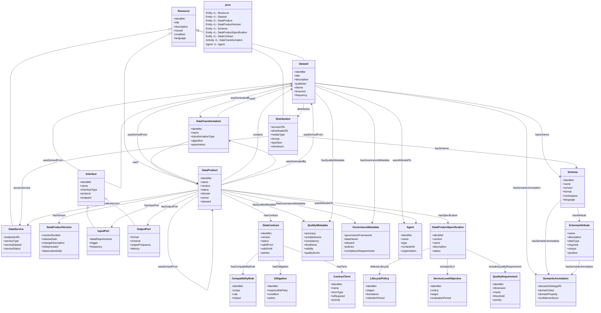
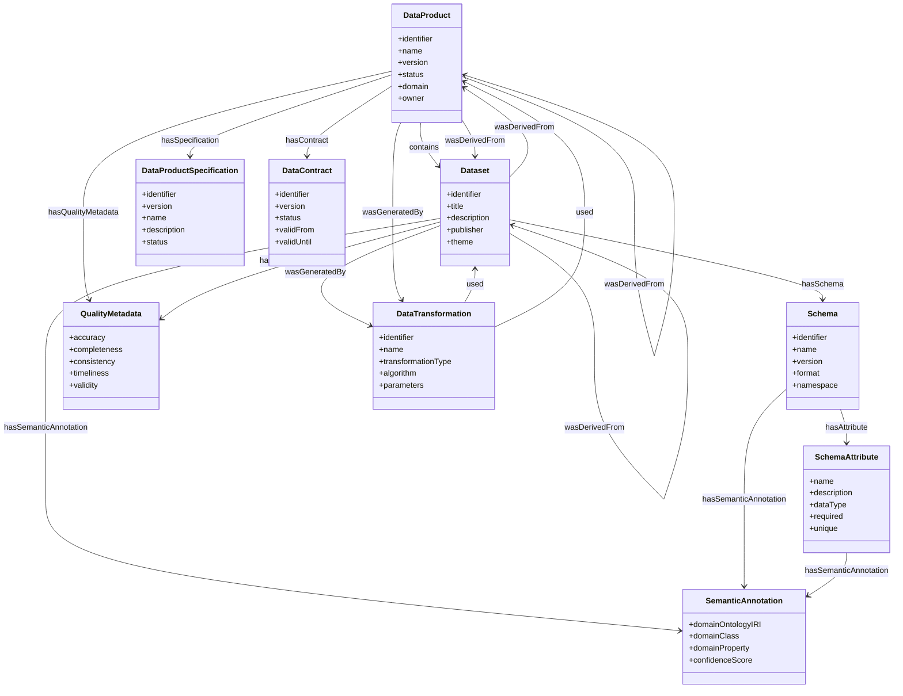
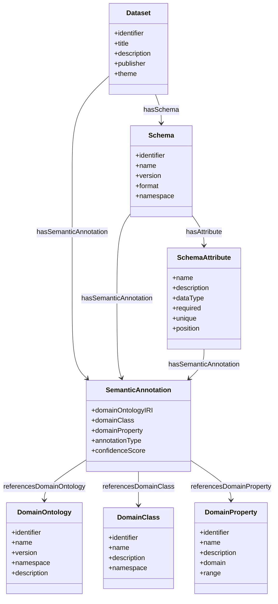
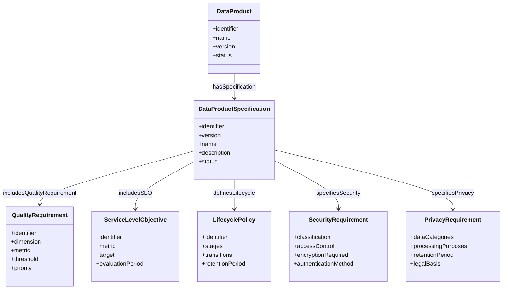
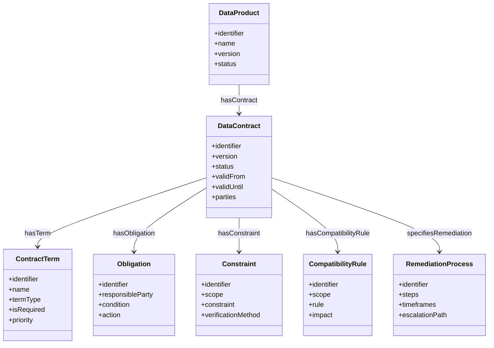
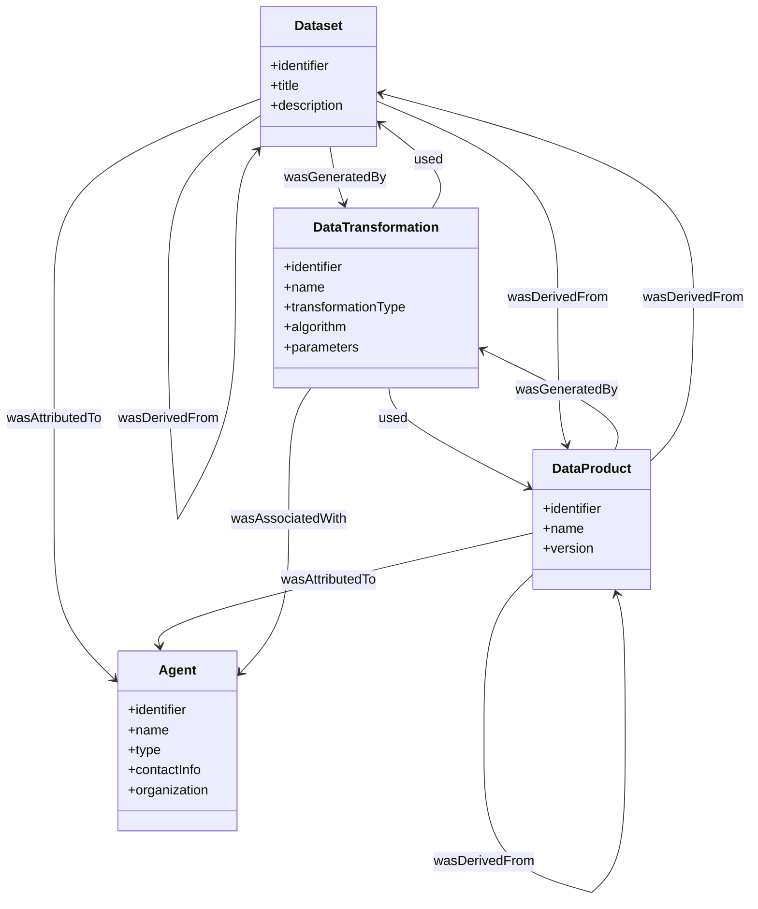

# Data Product Metamodel Ontology

## 1. Introduction

This document presents a comprehensive metamodel ontology for data products that integrates and extends concepts from several foundational ontologies:
- **dprod**: Data Product Ontology
- **DCAT-3**: Data Catalog Vocabulary
- **PROV**: Provenance Ontology

The metamodel addresses key limitations in these ontologies while adding support for:
- Open Data Product Specifications (ODPS)
- Open Data Contract Specifications (ODCS)
- Enhanced metadata from ODDS (Open Data & Data Spaces Integration Schema)
- Schema definitions (missing in DCAT)
- Semantic labeling of datasets and attributes

## 2. Core Concepts and Architecture

The metamodel is organized into several interconnected components:

### 2.1 Complete Metamodel Diagram

The complete metamodel diagram in Mermaid syntax:

### 2.2 Core Components

The metamodel consists of four primary components:

1. **Core Data Product Framework**: Enhanced dprod concepts with ODDS metadata
2. **Dataset Management**: Based on DCAT-3 with schema extensions
3. **Specifications and Contracts**: New ODPS and ODCS ontologies
4. **Lineage and Provenance**: Integration of PROV ontology

Here's the core conceptual model:

## 3. Key Innovations

### 3.1 Schema Extension for DCAT

DCAT doesn't natively support schema definitions, so the metamodel adds:

- **Schema**: Structure definition for datasets
- **SchemaAttribute**: Individual fields/attributes within a schema
- **SemanticAnnotation**: Links schema elements to domain ontologies

The relationships between these classes enable comprehensive schema modeling and semantic labeling:

### 3.2 Open Data Product Specification (ODPS)

The ODPS component formalizes specifications for data products:

### 3.3 Open Data Contract Specification (ODCS)

The ODCS component formalizes agreements between data providers and consumers:

### 3.4 Data Lineage with PROV

The ontology integrates the PROV model for comprehensive data lineage:

## 4. Semantic Labeling Capabilities

A major focus of this metamodel is semantic labeling, which enables:

1. **Dataset Semantic Labeling**:
   - Datasets can be annotated with domain ontology concepts through SemanticAnnotation
   - This links datasets to specific domain classes defined in external ontologies

2. **Attribute Semantic Labeling**:
   - Schema attributes can be annotated with domain properties
   - Each annotation specifies the domainOntologyIRI, domainClass, and domainProperty

3. **Reference to Domain Ontologies**:
   - The SemanticAnnotation class stores the IRI of the referenced domain ontology
   - This enables lookup and validation against external domain models

## 5. Class and Property Definitions

### 5.1 Core Classes

| Class | Description | Key Properties | Subclass Of |
|-------|-------------|----------------|------------|
| Resource | Base class for all resources | identifier, title, description, issued, modified | prov:Entity |
| Dataset | A collection of data | identifier, title, description, publisher, theme, keyword | Resource, prov:Entity |
| Distribution | A specific representation of a dataset | accessURL, downloadURL, mediaType, format, byteSize | Resource |
| DataService | A service that provides access to data | endpointURL, serviceType, servesDataset | Resource |
| DataProduct | A data product with associated services and metadata | identifier, name, version, status, domain | Resource, prov:Entity |
| Schema | Structure definition for a dataset | identifier, name, version, format, namespace | prov:Entity |
| SchemaAttribute | An attribute or field in a schema | name, description, dataType, required, unique | - |
| SemanticAnnotation | Semantic annotation linking data elements to domain concepts | domainOntologyIRI, domainClass, domainProperty | - |

### 5.2 Specification Classes

| Class | Description | Key Properties | Subclass Of |
|-------|-------------|----------------|------------|
| DataProductSpecification | A formal specification for a data product | identifier, version, name, description, status | prov:Entity |
| QualityRequirement | A requirement related to data quality | identifier, dimension, metric, threshold | - |
| ServiceLevelObjective | An objective for service level | identifier, metric, target, evaluationPeriod | - |
| LifecyclePolicy | Policy for lifecycle management | identifier, stages, transitions, retentionPeriod | - |
| SecurityRequirement | Requirements related to data security | classification, accessControl, authenticationMethod | - |
| PrivacyRequirement | Requirements related to data privacy | dataCategories, processingPurposes, retentionPeriod | - |

### 5.3 Contract Classes

| Class | Description | Key Properties | Subclass Of |
|-------|-------------|----------------|------------|
| DataContract | A formal agreement between providers and consumers | identifier, version, status, validFrom, validUntil | prov:Entity |
| ContractTerm | A specific term in a data contract | identifier, name, termType, isRequired | - |
| Obligation | A required action as part of the contract | identifier, responsibleParty, condition, action | - |
| Constraint | A constraint on data usage or provision | identifier, scope, constraint, verificationMethod | - |
| CompatibilityRule | Rules for compatibility between versions | identifier, scope, rule, impact | - |
| RemediationProcess | Process for addressing contract violations | identifier, steps, timeframes, escalationPath | - |

### 5.4 Provenance Classes

| Class | Description | Key Properties | Subclass Of |
|-------|-------------|----------------|------------|
| DataTransformation | An activity that transforms data | identifier, name, transformationType, algorithm | prov:Activity |
| DataAgent | An agent responsible for data activities | identifier, name, type, contactInfo | prov:Agent |

### 5.5 Key Relationships

| Relationship | Domain | Range | Description |
|--------------|--------|-------|-------------|
| distribution | Dataset | Distribution | Links a dataset to its available distributions |
| hasSchema | Dataset, Distribution | Schema | Links a dataset or distribution to its schema |
| hasAttribute | Schema | SchemaAttribute | Links a schema to its attributes |
| hasSemanticAnnotation | Dataset, Schema, SchemaAttribute | SemanticAnnotation | Links elements to semantic annotations |
| contains | DataProduct | Dataset | Links a data product to contained datasets |
| hasSpecification | DataProduct | DataProductSpecification | Links a data product to its specification |
| hasContract | DataProduct | DataContract | Links a data product to its contract |
| wasGeneratedBy | Dataset, DataProduct | DataTransformation | Links an entity to its generating activity |
| used | DataTransformation | Dataset, DataProduct | Links an activity to entities it used |
| wasDerivedFrom | Dataset, DataProduct | Dataset, DataProduct | Links an entity to source entities |

## 6. Implementation Recommendations

When implementing this ontology:

1. Use a semantic web framework (RDF/OWL) to formalize the ontology
2. Implement the SemanticAnnotation class with proper IRI reference capabilities
3. Ensure proper integration with external domain ontologies
4. Validate that instances adhere to the PROV provenance patterns
5. Consider tools like Protégé for ontology development and validation
6. Use SPARQL for querying the ontology and instances
7. Implement a graph database for storing and querying instances

## 7. Turtle Representation

The complete ontology is provided in Turtle format in the accompanying file. The Turtle format defines all classes, properties, and relationships in a standard RDF serialization format compatible with most semantic web tools.

## 8. Conclusion

This metamodel ontology provides a comprehensive foundation for managing data products with their specifications and contracts, while enabling rich semantic annotation of datasets and their attributes. It addresses the schema limitations in DCAT and enhances dprod with ODDS metadata, creating a complete solution for data product management and semantic integration.
